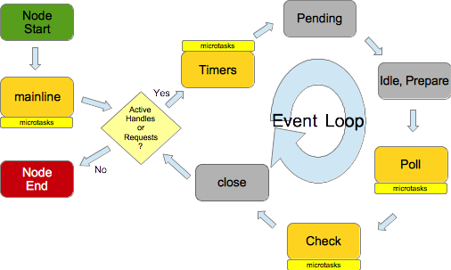

### Node.js Event Loop 执行顺序验证

基于 [Introduction to the event loop in Node.js](https://developer.ibm.com/tutorials/learn-nodejs-the-event-loop/) 文章的学习，对事件循环的执行顺序进行验证，结果符合预期。



> `process.nextTick/setImmediate/queueMicroTask`之间的差异

-   [process.nextTick() vs setImmediate()](https://nodejs.org/en/docs/guides/event-loop-timers-and-nexttick#processnexttick-vs-setimmediate) 前者队列先于后者队列执行，前者在 phases 之间执行（前一个 phase 之后，下一个 phase之前），后者在 check 这个特定的 phase 执行
-   [process.nextTick() vs. queueMicrotask()](https://nodejs.org/dist/latest-v18.x/docs/api/process.html#processnexttickcallback-args) 前者来自 node.js，后者来自 v8（标准 Web API 更推荐），两者在大部分场景中可相互替换，都是在 phases 之间执行（前一个 phase 之后，下一个 phase之前），且前者队列先于后者队列执行

```js
// 注意：setTimeout/setInterval 的 delay 最小间隔为 4ms，即 <= 4ms 都是立即执行，等价于 0ms

const { readFile } = require("fs");

// 下面等同于 MIN_DELAY = 0
// const MIN_DELAY = 4;
const MIN_DELAY = 5;
setTimeout(() => {
    console.log("setTimeout delay 0 (Timers phase)");
    queueMicrotask(() =>
        console.log("queueMicrotask in setTimeout delay 0 (Timers phase)"),
    );
});
setTimeout(
    () => console.log(`setTimeout delay ${MIN_DELAY} (Timers phase)`),
    MIN_DELAY,
);
setImmediate(() => {
    console.log("setImmediate (Check phase)");
    queueMicrotask(() =>
        console.log("queueMicrotask in setImmediate (Check phase)"),
    );
});

let count = 0;
const timerId = setInterval(() => {
    if (count === 0)
        console.log(
            `setInterval delay ${MIN_DELAY}, ${count}th (Timers phase)`,
        );
    else {
        console.log(
            `setInterval delay ${MIN_DELAY}, ${count}th (Timers phase)`,
        );
        clearInterval(timerId);
        return;
    }

    count++;
}, MIN_DELAY);

queueMicrotask(() =>
    console.log("queueMicroTask in main (mainline microtasks)"),
);
process.nextTick(() =>
    console.log("process.nextTick in main (mainline microtasks)"),
);

readFile("./demo1.js", (err, data) => {
    console.log("readFile (Poll IO phase)");
});
console.log("main");
```

`MIN_DELAY=5`时的 node v16.20.0 输出

```bash
main
process.nextTick in main (mainline microtasks)
queueMicroTask in main (mainline microtasks)
setTimeout delay 0 (Timers phase)
queueMicrotask in setTimeout delay 0 (Timers phase)
readFile (Poll IO phase)
setImmediate (Check phase)
queueMicrotask in setImmediate (Check phase)
setTimeout delay 5 (Timers phase)
setInterval delay 5, 0th (Timers phase)
setInterval delay 5, 1th (Timers phase)
```

`MIN_DELAY=4`时的 node v16.20.0 输出

```bash
main
process.nextTick in main (mainline microtasks)
queueMicroTask in main (mainline microtasks)
setTimeout delay 0 (Timers phase)
queueMicrotask in setTimeout delay 0 (Timers phase)
setTimeout delay 4 (Timers phase)
setInterval delay 4, 0th (Timers phase)
readFile (Poll IO phase)
setImmediate (Check phase)
queueMicrotask in setImmediate (Check phase)
setInterval delay 4, 1th (Timers phase)
```
